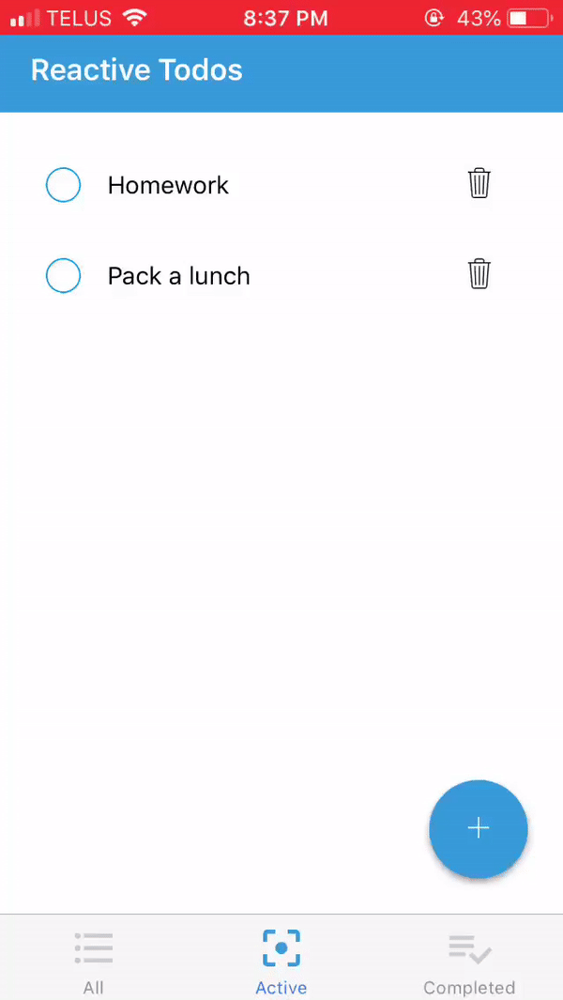

# Reactive Todos

A shared todos list built with ReactiveSearch Native. This was a project I used to learn how the basics of React Native. My final solution did not work, so I just cloned their repo and am using this to save as a reference. 

Built with

* [React](https://reactjs.org/)
* [ReactiveSearch for Native](https://github.com/appbaseio/reactivesearch/tree/dev/packages/native)
* [Appbaseio](https://appbase.io)
* Step by step guidance from https://medium.freecodecamp.org/how-to-build-a-real-time-todo-app-with-react-native-19a1ce15b0b3 

# Demo
